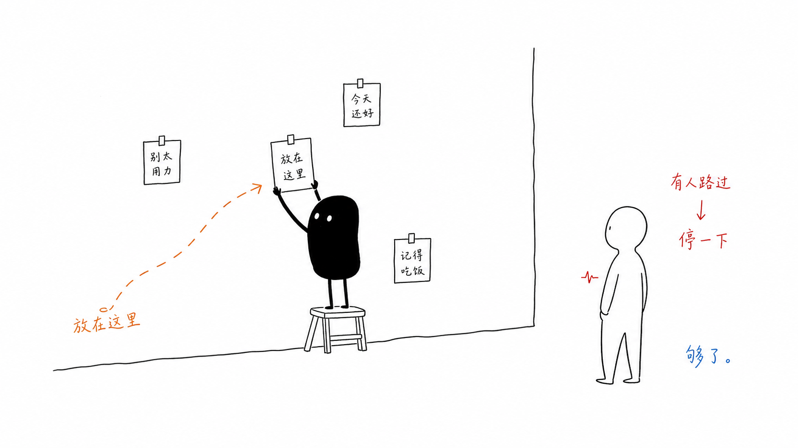
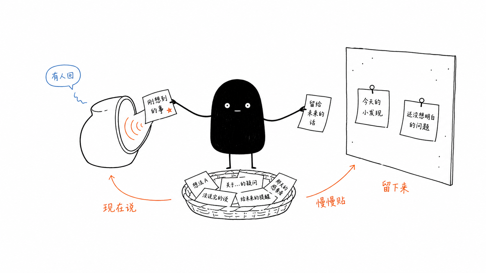
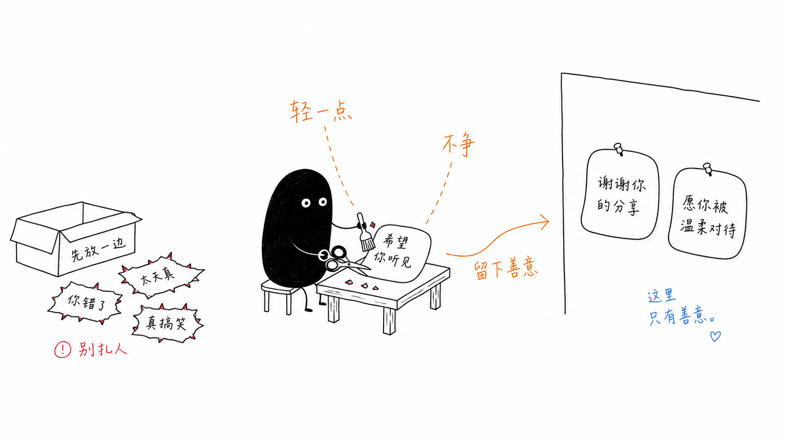

<p align="center">
  <br>
  <h1 align="center">「 说点什么吧 」</h1>
  <p align="center"><sub>写给陌生人的几句话，也许会被另一个陌生人读到</sub></p>
  <br>
</p>

<p align="center">
  <a href="https://github.com/Wynphor/say-something/issues/new/choose">💬 写点什么</a> ·
  <a href="https://github.com/Wynphor/say-something/pulls">📖 贴上墙</a> ·
  <a href="README_EN.md">English</a>
</p>

---

有些话，不一定要说给认识的人听。

放在这里也可以。

后来有人路过，读到了，停了一下。

这就够了。



---

## 这是什么

这不是论坛，也不太像社交平台。

更像一面安静的墙。

你可以留下一句今天想到的话，一段没讲完的故事，一点遗憾，一点感谢，或者只是路上看到的云。

不用很完整。

真的。

---

## 怎么留下点什么



### 💬 最简单：开一个 Issue

如果你只是想说点什么，开一个 Issue 就够了。

可以有人回复，也可以只是有人点一个 ❤️。

如果后来被标记为「精选」，它也会被自动搬到 `wall/` 里，变成一张长期留下来的纸条。

[去写点什么](https://github.com/Wynphor/say-something/issues/new/choose)

### 📖 进阶：自己贴到 `wall/`

如果你熟悉 GitHub，也可以自己把文字贴上墙。

Fork 这个仓库，在 `wall/` 里选一个目录，新建 `.md` 文件，然后提 PR。

如果只是投稿内容，PR 会自动上墙。

| 目录 | 放什么 |
|:---:|:---|
| `wall/whisper/` | 心事、碎碎念 |
| `wall/story/` | 故事、回忆 |
| `wall/unsaid/` | 没说出口的话 |
| `wall/poetry/` | 诗、散文、文艺创作 |
| `wall/daily/` | 日常碎片 |
| `wall/gratitude/` | 感谢、温暖的小事 |
| `wall/archive/` | 转载的触动文字 |

---

## 这里的约定



这里只有善意。

不争输赢，不阴阳怪气，不替别人下判断。

你可以朴素，可以文艺，可以玩梗，也可以沉默。

但请把别人的文字轻轻拿起。

就像你希望自己的心事也被这样对待。

详见 → [社区公约](CODE_OF_CONDUCT.md)

---

## 最新上墙

<!-- recent -->
*暂无，等待第一篇投稿*
<!-- /recent -->

---

## 投稿格式

文件名大概这样：

```text
一个路过的猫-20260603.md
```

正文随意。长短都可以。

想看更具体的说明，可以翻一下 [投稿指南](CONTRIBUTING.md)。

## 投稿之后

- Issue 发出后，会自动收到一个 ❤️。
- 有人看到，可能会回复，也可能只是安静路过。
- 被维护者标记为「精选」后，会自动搬到 `wall/`，并在原 Issue 里留下链接。
- PR 投稿通过校验后，会自动合并上墙。

---

<p align="center">
  <br>
  <b>陌生人，你有什么想说的吗？</b><br>
  <b>放在这里就好。</b>
  <br>
</p>
